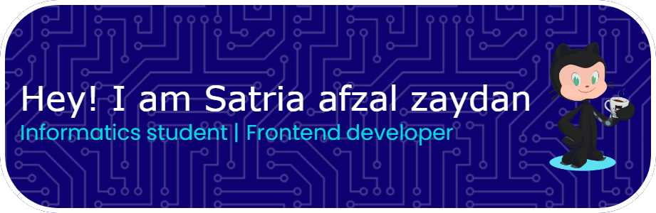

## Hello I'm Satria afzal zaydan, and i'm Informatics student 👋

<!--
**satriafzal/satriafzal** is a ✨ _special_ ✨ repository because its `README.md` (this file) appears on your GitHub profile.

Here are some ideas to get you started:

- 🔭 I’m currently working on ...
- 🌱 I’m currently learning ...
- 👯 I’m looking to collaborate on ...
- 🤔 I’m looking for help with ...
- 💬 Ask me about ...
- 📫 How to reach me: ...
- 😄 Pronouns: ...
- ⚡ Fun fact: ...
-->
##### 💻 Tech Stack

##### 🛠 Tools

##### 📱 Connect with me

- 😄 Pronouns: **He/Him**
- 💻 I’m currently **learning Python,Java,JS,Go**
- 💬 Ask me about : *I'm **Satria**, a dedicated 19-year-old Informatics student at Nusa Mandiri University, actively learning and growing within the dynamic field of computer science with a clear goal: to become a proficient Full Stack, Web, or Mobile Developer. I'm passionate about understanding technology and building user-friendly applications*

